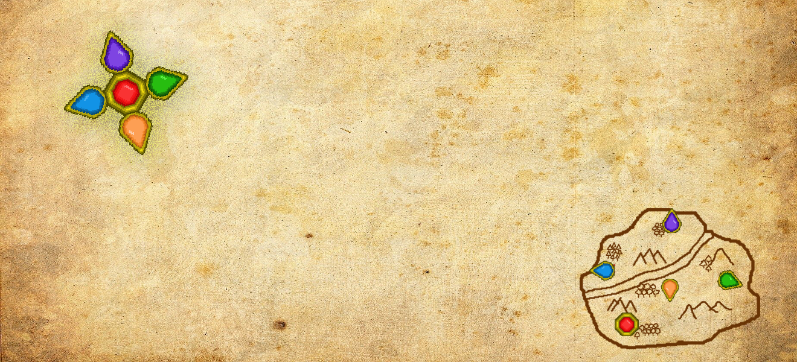
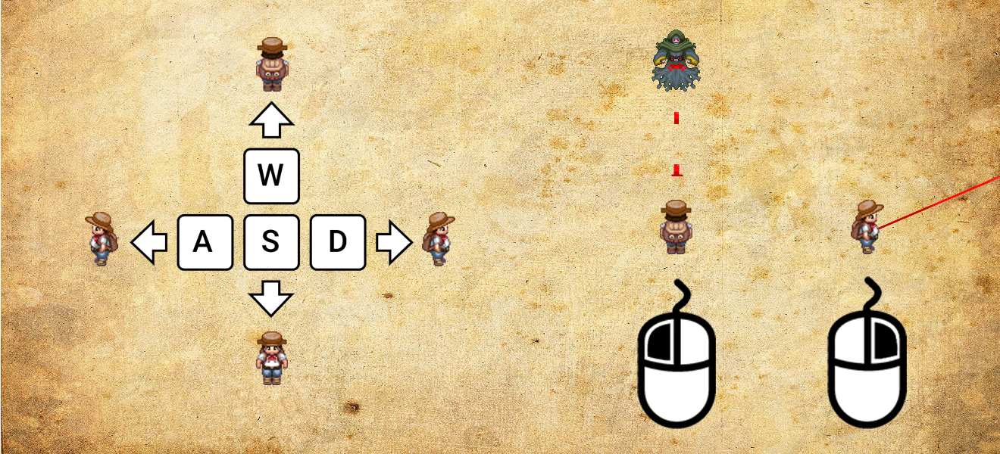
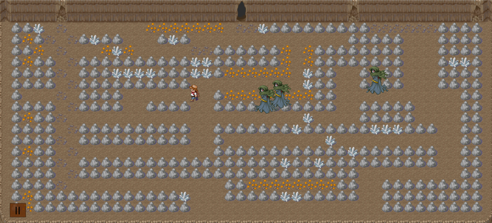

# Pentaphylacterium

### Descripción
Ayuda al intrépido explorador a surcar las laberínticas y peligrosas mazmorras llenas de espectros en búsqueda de los fragmentos perdidos del mítico talismán, el legendario Pentaphylacterium codiciado por todos los cazatesoros.

### Controles
Controla a tu personaje con las letras a, s, d, w del teclado y dispara rayos de luz con el click izquierdo del mouse para ahuyentar a los espectros, también puedes activar una mira para mejorar tu precisión.

 Entre más tiempo pases dentro de la mazmorra más espectros irán a por tí así que ve a la salida lo más rápido posible.
 
 

### Reconocimientos
- La concepción, diseño y producción del videojuego pertenecen a la autoría de los estudiantes Santiago Gutiérrez Valderrama y Luis Fernando Romero Rojas
- Todos los audios usados en este programa fueron creados por Camila Andrea Gómez Pérez, estudiante de tercer nivel de pregrado en la carrera de música de la Universidad Industrial de Santander.
- La codificación del videojuego se realizó bajo la supervisión de Camilo Eduardo Rojas Ortiz, docente cátedra UIS y con el apoyo e instrucción de Alex Julián Mantilla Ríos, estudiante de noveno nivel de pregrado en la carrera de ingeniería electrónica de la Universidad Industrial de Santander.
